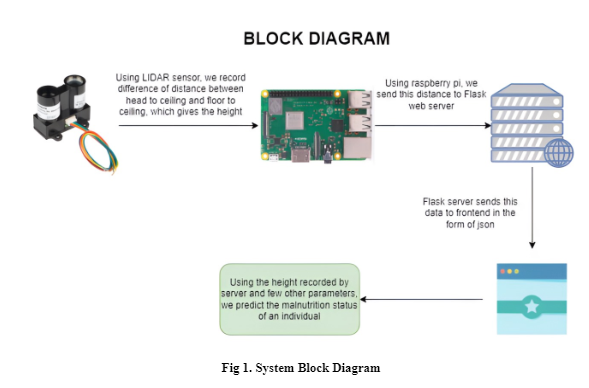
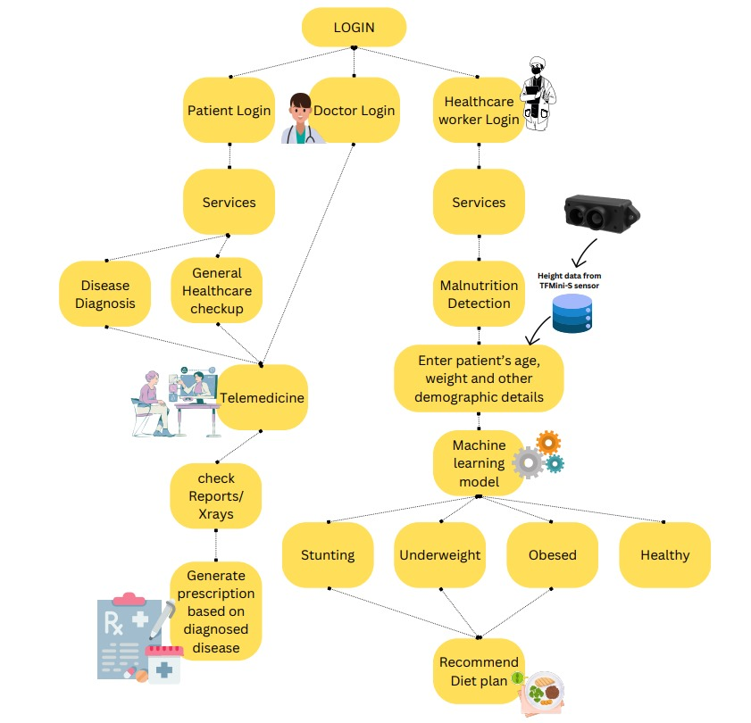
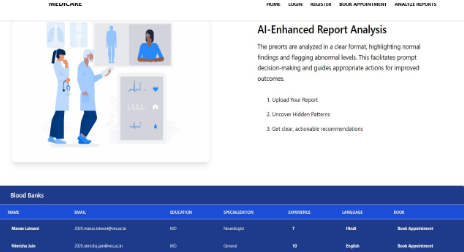
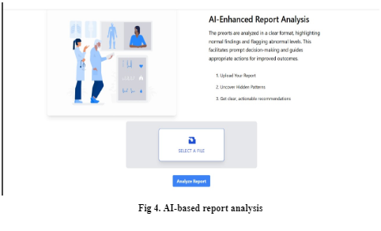
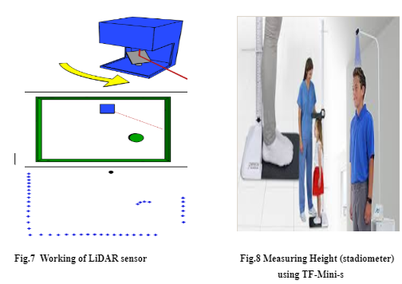
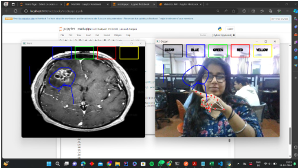
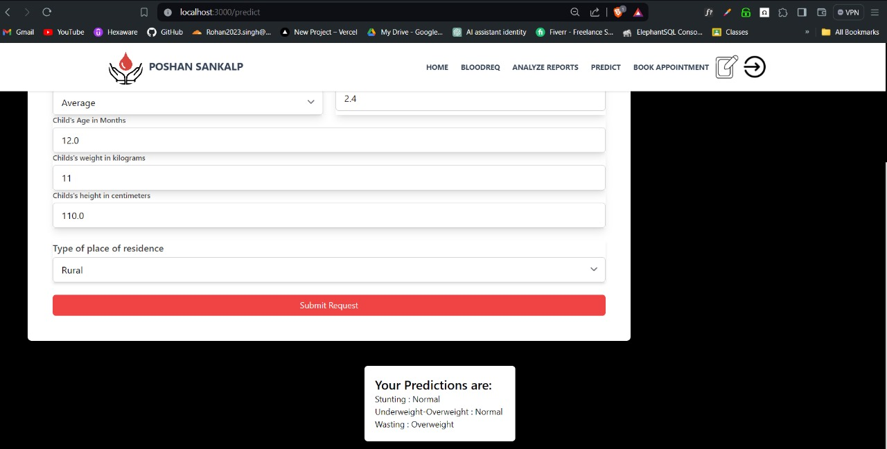

In today's rapidly evolving landscape of healthcare, the integration of emerging technologies offers unprecedented opportunities to address longstanding challenges such as cumbersome and impractical techniques for height measurement, as well as the lack of access to medical expertise and support, particularly in remote or underserved areas. This convergence of telemedicine, innovative sensor technology, and machine learning presents a transformative approach that holds the potential to revolutionize healthcare delivery, improve patient outcomes, and bridge existing disparities in access to quality care.
Traditionally, height measurement has relied on cumbersome techniques such as carrying stadiometers, which can be impractical, especially in fieldwork or rural settings. However, with the advent of innovative sensor technology, such as depth-sensing cameras and LiDAR sensors, there is an opportunity to reimagine height measurement in a more efficient and user-friendly manner. These sensors can capture precise measurements without the need for traditional instruments, offering a non-invasive and streamlined approach to healthcare assessments.
By integrating these sensors into telemedicine platforms, healthcare providers can conduct remote consultations and accurately measure patients' height in real-time, eliminating the need for physical presence and cumbersome equipment. Patients can simply stand in front of a depth-sensing camera or LiDAR sensor, and their height can be accurately measured and recorded within seconds. This not only enhances the convenience and efficiency of height measurement but also improves the overall patient experience, particularly for individuals in remote or underserved areas who may face barriers to accessing traditional healthcare services.
Moreover, the integration of machine learning algorithms further enhances the capabilities of telemedicine platforms by analyzing vast amounts of patient data and providing actionable insights to healthcare providers. These algorithms can assist in diagnosing conditions, predicting disease progression, and recommending personalized treatment plans based on individual patient characteristics and medical history. For example, machine learning algorithms can analyze height measurements along with other health metrics to identify potential growth abnormalities or nutritional deficiencies, enabling early intervention and preventive care.
Furthermore, telemedicine platforms can facilitate virtual consultations with specialist physicians, regardless of geographic location. Patients in remote or underserved areas no longer need to travel long distances to access specialized care; instead, they can connect with healthcare providers via video conferencing technology and receive expert medical advice and support from the comfort of their homes. This not only improves access to medical expertise but also reduces the burden on healthcare infrastructure and alleviates the strain on patients and caregivers.
In addition to height measurement, innovative sensor technology and telemedicine can be leveraged to address a wide range of healthcare needs, from remote monitoring of chronic conditions to early detection of diseases. Wearable devices equipped with sensors can continuously monitor vital signs and health parameters, providing real-time data to healthcare providers and enabling proactive interventions when necessary. For example, wearable devices can monitor blood pressure, heart rate, and respiratory rate, alerting healthcare providers to any abnormalities or changes in the patient's health status.
Moreover, telemedicine platforms can facilitate remote monitoring of patients with chronic conditions, such as diabetes or hypertension, enabling healthcare providers to track their progress and adjust treatment plans accordingly. By empowering patients to actively participate in their healthcare journey and providing timely interventions, telemedicine and sensor technology can improve health outcomes and reduce healthcare costs in the long term.
Furthermore, machine learning algorithms can analyze data from wearable devices and telemedicine platforms to identify patterns and trends that may indicate potential health risks or complications. For example, machine learning algorithms can detect subtle changes in a patient's vital signs that may precede a heart attack or stroke, enabling early intervention and preventive measures to be taken.
In conclusion, the integration of telemedicine, innovative sensor technology, and machine learning presents a transformative approach to address cumbersome and impractical techniques for height measurement, as well as the lack of access to medical expertise and support, particularly in remote or underserved areas. By leveraging these technologies, healthcare providers can deliver high-quality, patient-centric care, improve health outcomes, and reduce healthcare disparities. As technology continues to advance, the potential for innovation in healthcare delivery is limitless, offering hope for a healthier and more equitable future for all.

Objectives:
Develop a telemedicine platform integrated with innovative sensor technology to enable remote height measurement with high accuracy and reliability.
Implement machine learning algorithms to analyze height measurement data and enhance the precision of measurements over time.
Facilitate virtual consultations between patients and healthcare professionals, enabling timely access to medical expertise and support irrespective of geographical constraints.
Improve healthcare accessibility and quality, particularly in remote or underserved areas, by providing convenient and reliable height measurement and medical consultations.
Enhance patient outcomes by enabling early detection of growth abnormalities, monitoring of developmental milestones, and facilitating personalized treatment planning based on accurate height measurements and medical assessments.
Ensure user-friendly interfaces for both patients and healthcare providers to promote ease of use and seamless interaction with the telemedicine platform and sensor technology.
Ensure compliance with healthcare regulations and standards, particularly regarding data security, privacy, and confidentiality of patient information.
Evaluate the effectiveness and usability of the integrated telemedicine and sensor technology solution through pilot studies and user feedback, iteratively refining the system to optimize performance and user experience.

System Block Diagram:

 
               Fig 3. System Block diagram

4.1 System Design / Conceptual Design (Architectural)
In this system design report, we propose the architecture of Malnutrition dataset. We’ll be working with dataset of type image and numerical. Our height parameter will come from sensor, which will reduce the load of NGOs in measuring the malnutrition status of childrens..
System Architecture:

The Malnutrition Detection Model is designed to perform the following tasks:
Data Collection: Collect height from the sensor and other parameters from an existing database.
Verifying height parameter: To check if the height collected from the sensor is correct,  we will check it with a XGBoost model
Data Preprocessing: Preprocess the parameters with checking for issues like missing data, categorical values, etc.
Model building: We’ll be building 2 models for the malnutrition detection, first an Decision Tree statistical model to check malnutrition status from the height taken from sensor and the other a CNN model to check malnutrition status from an image.
Model Training:
  Train the integrated model on the labeled dataset, employing loss functions and optimizers suitable for multi-class classification tasks.Monitor the model's performance on a validation dataset to prevent overfitting.
Model Evaluation:
   Evaluate the model's performance on a test dataset using metrics such as accuracy, precision, recall, F1 score, and confusion matrices.Assess the model's ability to classify malnutrition content accurately.

Technologies and Frameworks: The Malnutrition Detection Model will be implemented using the following technologies and frameworks:

Python: As the primary programming language for ML model development.
TensorFlow/Keras: For building and training the models.
scikit-learn: For model evaluation and metrics calculation.
Flask/Django: For creating a web-based or API-based deployment.

Detailed Design of the solution:

         Fig 2. Complete workflow of the Medicare 

Implemntation of Website:

        Fig 3. Book Appointment with Doctor page 

        Fig 4. AI-based report analysis

       
       Fig 5.  Analysis of the report

       fig 6. TF Mini Sensor 

       Fig.9 Telemedicine helps get expert advice through the comfort of your home.

     Fig.10 Prediction Webpage I

Fig.11 Prediction Webpage II
       
       